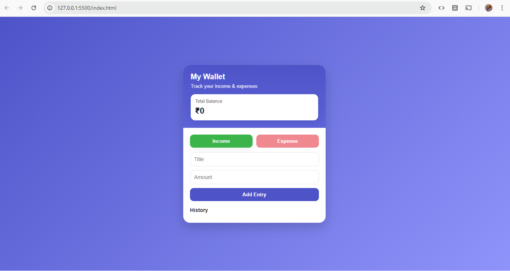
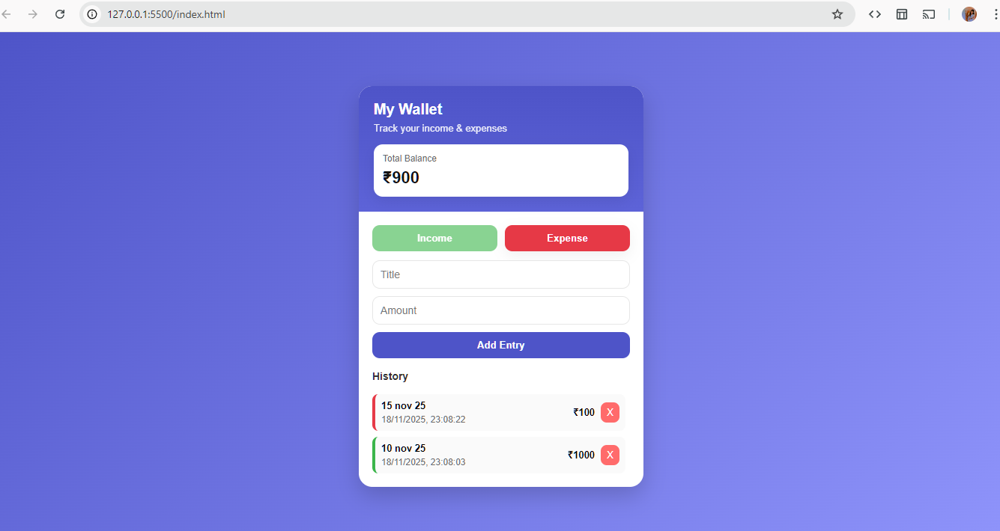

# expenses-tracker
A simple and modern Expense Tracker built with HTML, CSS and JavaScript. Track income and expenses, view history, and see your total balance instantly. All data is saved using LocalStorage, so it stays even after refresh. Clean UI, easy to use, fully offline, and perfect for beginners learning JavaScript.

# 💰 Expense Tracker – Modern UI (HTML / CSS / JavaScript)

A clean, modern, fully responsive **Expense Tracker App** built using pure  
HTML, CSS, and JavaScript. This app helps users manage their **income & expenses**  
with a simple and beautiful interface.

---

## 🚀 Features

### ✅ Add Income & Expense  
Easily add money received and spent with a single click.

### ✅ Modern App-Style UI  
Elegant look similar to premium finance apps.

### ✅ Smart Balance Calculation  
Total balance is automatically updated based on entries.

### ✅ LocalStorage Support  
All data is saved in the browser—no backend required.  
Your history stays safe even after refreshing or closing the tab.

### ✅ Delete Entries  
Remove any record instantly from the history.

### ✅ Timestamp for Each Entry  
Shows the exact date & time of each transaction.

---

## 🧱 Tech Stack
- **HTML5**
- **CSS3**
- **Vanilla JavaScript**
- **LocalStorage API**

---

## 📁 Project Structure
index.html
style.css
app.js
README.md

## 📸 Screenshots

### Before

### After

